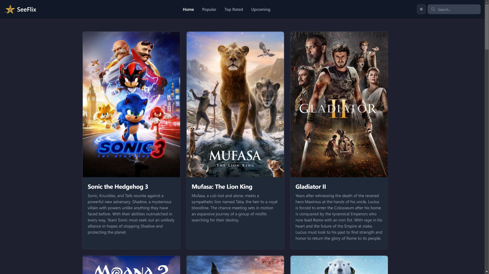
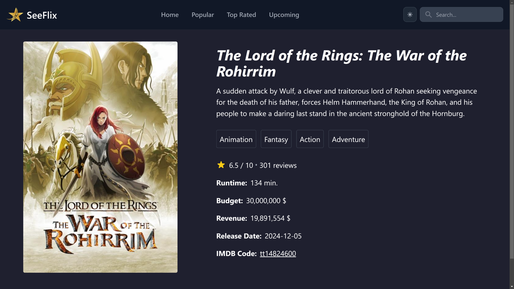

<h1>SeeFlix</h1>

SeeFlix is a dynamic web application for movie enthusiasts. It allows users to browse, search, and explore details about their favorite movies and shows. Powered by the IMDb API, SeeFlix fetches real-time data to provide the latest movie information with a seamless user experience.

<h3>Technologies Used</h3>
<ul>
  <li><strong>IMDb API</strong> – Used to fetch real-time movie data such as title, synopsis, release date, ratings, and more.</li>
  <li><strong>HTML/CSS</strong> – Used for building the structure and styling of the web pages to ensure a responsive and visually appealing layout.</li>
  <li><strong>JavaScript</strong> – Implements functionality such as searching, filtering, and dynamic data fetching from the IMDb API.</li>
  <li><strong>React</strong> – A JavaScript library for building the user interface and managing component states and interactions.</li>
</ul>

<h3>Features</h3>
<ul>
  <li><strong>Browse and Search</strong>: Users can search for their favorite movies or browse through a curated list of recent movies.</li>
  <li><strong>Movie Details</strong>: Each movie has a dedicated page that provides detailed information such as title, release date, synopsis, and ratings.</li>
  <li><strong>Responsive Layout</strong>: The app adapts dynamically to screen sizes, providing a consistent user experience across desktops, tablets, and smartphones.</li>
  <li><strong>Real-Time Data</strong>: The IMDb API ensures that users always have access to up-to-date movie information.</li>
</ul>

<h3>Screenshots</h3>

<table>
  <tr>
    <td>
      
    </td>
    <td>
      <b>Main Page:</b>
      

        The main page displays a curated list of recent movies fetched from the IMDb API. Each movie is presented in a visually appealing card format, with options to view more details. The layout adapts dynamically to screen sizes for a consistent user experience across devices.
      

    </td>
  </tr>
  <tr>
    <td>
      
    </td>
    <td>
      <b>Movie Details Page:</b>
      

        The movie details page provides in-depth information about the selected movie. Users can view the title, synopsis, release date, and ratings. The clean and intuitive layout ensures that all relevant details are easily accessible.
      

    </td>
  </tr>
</table>

<h3>How It Works</h3>

<h4>1. Searching for Movies</h4>

Users can search for any movie by typing its name in the search bar. The search results are fetched in real time from the IMDb API and displayed in a grid format. Each result is shown with the movie poster, title, and release year. Clicking on a movie card takes the user to the movie's detailed page.

<h4>2. Viewing Movie Details</h4>

On the movie details page, users can see more information about the selected movie, such as the full synopsis, release date, genre, and ratings from IMDb. This page provides all the relevant details to help users decide if they want to watch the movie.

<h4>3. Real-Time Data Fetching</h4>

Using the IMDb API, the app fetches real-time data about movies and shows. When users search or navigate to a movie's details page, the app makes API calls to retrieve the most current information available. This ensures that the data is always up-to-date.

<h4>4. Responsive Layout</h4>

The app is built with a mobile-first approach, ensuring it looks great on all screen sizes. Whether on a desktop or mobile device, the layout adjusts to provide an optimal viewing experience. This responsiveness is achieved using CSS media queries and flexible layouts.

